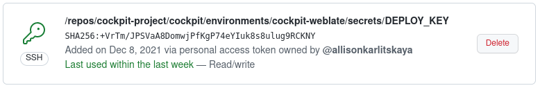
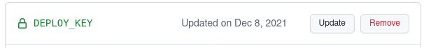
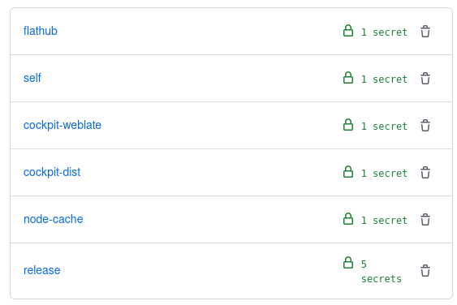

---
title: Securing GitHub workflows
subtitle:
author: Martin Pitt <<mpitt@redhat.com>>
email: mpitt@redhat.com
date: Cyborg Infrastructure Seminar 2022
theme: Singapore
header-includes:
 - \hypersetup{colorlinks=true}
 - \setbeameroption{hide notes}
...

# Naïve situation

(until ~ one year ago)

 - Single almighty github.com/cockpituous token
 - cockpit-project org wide secrets
 - every developer does `npm install` all the time

:::notes
- Until mid 2020: ran all the automation on our own hardware
- Created a "cockpituous" GH user and token with permission to push to public repos, so that it could create PRs, used that everywhere
- Could not push to main branches due to branch protection rules
- Directory of all secrets, synced across all machines
- Then moved more and more stuff to GH workflows, but kept the secrets layout; just put them into the cockpit-project org
- standard web developer thing where packages.json specifies NPM dependencies, developers install with npm CLI
:::


# Now

 - *zero* custom GitHub tokens for workflows
 - low-priv token for custom infra (`read:org`, `repo:status`)
 - workflows minimize privileges
 - compartmentalized secrets
 - no `npm install` on dev machines

:::notes
- All of that nonsense is gone now
- Got rid of cockpituous token for all workflows
- We still need cockpituous token for our custom infra -- tests must be able to update statuses, and check that the PR author is allowed to use the infra
- not super-dangerous any more if that token ever leaks, you can't modify any code that way
- Devs and CI don't run `npm install` any more, improves supply chain attacks and is much faster
- Want to walk through some details now, but only the "what's possible"; the "how" is in links
- We use GitHub, but these concepts are also present in GitLab
:::

# Intra-project: Default GitHub token

GitHub: `${{secrets.GITHUB_TOKEN}}` ([documentation](https://docs.github.com/en/actions/using-workflows/workflow-syntax-for-github-actions#permissions))

GitLab: `${CI_JOB_TOKEN}` ([documentation](https://docs.gitlab.com/ee/security/token_overview.html#cicd-job-tokens))


```yaml
    permissions:
      contents: read
      packages: write
```

example workflow: [refresh unit-tests container](https://github.com/cockpit-project/cockpit/blob/main/.github/workflows/unit-tests-refresh.yml)


:::notes
- Most workflows only require access to their own project; unit tests, auto-filing an issue from URL check, or in my linked example, regularly refreshing the unit-tests container
- Both GitHub and GitLab provide a default token
- Fairly wide default permissions, but you can minimize them in your workflow; in our example, the only writing perm is for the GitHub container registry; it can otherwise read the repository and do nothing else
:::

# Inter-project: Deploy keys

cockpit-weblate repo public key:
\

secret key on cockpit repo:
{width=70%}\

```yaml
  - uses: actions/checkout@v2
    with:
      repository: ${{ github.repository }}-weblate
      ssh-key: ${{ secrets.WEBLATE_DEPLOY_KEY }}
```


[POT refresh workflow](https://github.com/cockpit-project/cockpit/blob/main/.github/workflows/weblate-sync-pot.yml)

:::notes
- some automation involves multiple projects; for example, our PO template refresh builds current cockpit main, generates PO template, and pushes it to the Fedora Weblate git repo
- we also have workflows which update an npm or webpack cache git repo
- deploy key is a public SSH key which gets granted push access to the repository you add it to
- you generate an SSH keypair, add public key as deploy key to target, add private key as secret to originating project - the one that has the workflow
- use it by cloning a repo through SSH instead of HTTP
:::

# Deploy key management

[github-upload-secrets script](https://github.com/cockpit-project/bots/blob/main/github-upload-secrets)

[cockpit's deploy keys](https://github.com/cockpit-project/cockpit/blob/main/.github/deploy-keys.sh)

[GitHub documentation](https://docs.github.com/en/developers/overview/managing-deploy-keys)

[GitLab documentation](https://github.com/cockpit-project/cockpit/blob/main/.github/deploy-keys.sh)


:::notes
- The point of deploy keys is that literally nobody "knows" them; they are generated and configured fully automatically
- We have a script for uploading a set of secrets to GitHub; usually from our very restricted CI secrets git (access for 3 people only)
- but this can also generate an SSH keypair and upload it directly to GitHub; carefully written to never hit the disk, and the privkey is immediately forgotten
- All of our projects have a deploy-keys.sh script which calls github-upload-secrets for all the deploy keys that it needs
- With that, we can refresh the keys arbitrarily often and don't have to remember the details; but it needs to be done by a project admin who has project admin permissions; we don't want to put such a powerful token into automation
- Again, this works both for GitHub and GitLab, documentation links on the slide
:::

# Environments

{height=40%}\

in `weblate-sync-pot.yml`:
```yaml
  environment: cockpit-weblate
```

:::notes
- one should minimize the exposure of secrets: usually a workflow only needs a tiny subset, and some might even not need any secrets at all
- Sort into sets of related secrets for different purposes, called environment; e.g. cockpit-weblate env only has the deploy key for the weblate repo; the release env has e.g. the Fedora password and the COPR token
- select a workflow's environment; this has the nice effect that if you don't specify it, a workflow has no secrets at all, as we don't have any org or project wide secrets any more; access to secrets is opt-in
- Again, management of the environments must be automated; we use the already mentioned github-upload-secrets script
:::


# NPM cache

[Recent attack on the npm `coa` module](https://github.com/advisories/GHSA-73qr-pfmq-6rp8):

```yaml
"preinstall": "start /B node compile.js & node compile.js"
```

[Org-wide `node_modules/` cache](https://github.com/cockpit-project/node-cache/), used as git submodule

[npm install cache builder workflow](https://github.com/cockpit-project/cockpit/blob/main/.github/workflows/npm-install.yml)

:::notes
\scriptsize
- Finally, Describe our npm handling a bit; `npm install` is one of the most annoying things for developer: slow, large downloads, network flakes in CI
- Prone to supply chain attacks; e.g. 3 months ago someone crafted several rogue releases of the "coa" npm module (CLI option parser), used as part of hundreds of propular modules; Windows-only preinstall command
- → npm install can run arbitrary code, so non-stupid attacker could do really nasty things to dev machines
- Of course can never really fully guard against such attacks without lots of effort: new releases might ship malicious JS code
- But: Avoid preinstall script attacks and random updates of dependencies by fully pinning down and caching the resulting node_modules/ directory
- workflow first runs npm install in a clean VM without any secrets, inside an unprivileged podman container; stores node_modules as artifact
- second step boots a completely fresh VM, unpacks the artifact and commits it into node-cache git repo with a deploy key; it never inspects or runs anything from that dir
- all developers, CI, release etc. only ever uses the git cache as a submodule; updates gated by CI
:::
