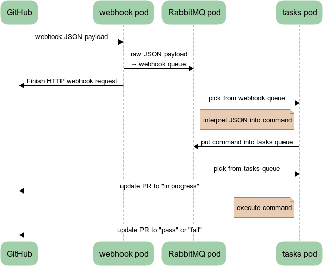
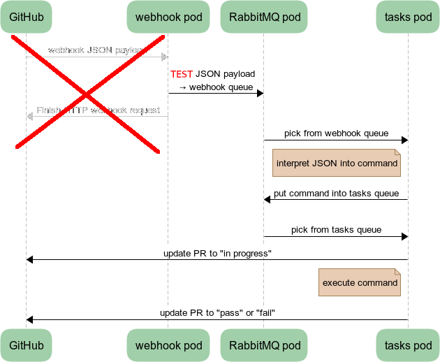

---
title: (Mostly) Self-testing infrastructure updates
subtitle:
author: Martin Pitt <<mpitt@redhat.com>>
email: mpitt@redhat.com
date: Cyborg Infrastructure Seminar 2022
theme: Singapore
header-includes:
 - \hypersetup{colorlinks=true}
 - \setbeameroption{hide notes}
...

# Workload overview

GitHub workflows as much as possible

Own infra for `/dev/kvm`: tests, image builds

* Bunch of [tasks containers](https://github.com/cockpit-project/cockpituous/tree/main/tasks) on powerful machines
* Plus GitHub API glue and credentials

:::notes
- Last year topic: deploy proposed infra changes to staging env; hard problem, but have 80/20 solution now
- Everything that does not require /dev/kvm runs on GitHub: releases, translation updates, NPM cache, unit tests, URL checks, etc.
- Many of these effortlessly run on forks, some of them require some credential setup, but mostly unproblematic; ignored for this talk
- Our VM image builds and integration tests require direct QEMU control and thus /dev/kvm; still hard to come by, maintain custom infra
- For purposes of this talk: one webhook container and a sufficient number of tasks containers which need to run reasonably powerful hardware
- Communicates to GitHub via its API, and a small number of secrets
:::

# Production event flow

{height=75%}

[Webhook payload → AMQP code](https://github.com/cockpit-project/cockpituous/blob/586fb184e08952bdab1f2dcc99f6ab684e2a4680/tasks/webhook#L127)

:::notes
- three phases
- starts at top left with a GitHub event: open or update PR; calls URL in our infra with JSON payload
- payload is ephemeral → put as-is into AMQP webhook queue
- tasks bot picks off the payload from webhook queue, interprets it, turns it into a shell command such as a parameterized test invocation, puts into tasks queue
- tasks bot picks off command from tasks queue, sets PR status to "in progress", runs command, and sets PR status to pass/fail
- the first phase is really simple, and basically never changes; see link on the slide
- at the same time that's the hardest to replicate, as it requires privileged GitHub project configuration and production secret
- the other two phases are complex, change over time, don't depend on production secrets
:::

# Infra PR event flow

{height=75%}

:::notes
- we realized that if we drop that first phase and replace it with a mocked JSON payload, we avoid the one thing that's hard to replicate: the GitHub webhook config
- we can run a test which does not require /dev/kvm, just something very fast and simple (quick python unittest); that's fine because the real tests get changed in a completely different project than the infrastructure; we just want to check the logic and glueing of the infra, not what particular payload it runs
- with these two simplifications, the deployment can run literally anywhere, including local dev machine and GitHub workflow
:::

# Running the infra locally

[run-local.sh](https://github.com/cockpit-project/cockpituous/blob/main/tasks/run-local.sh):

 - Generate fake secrets and simple configuration
 - Run pods: AMQP, tasks, VM images/logs
 - Tests for interaction between these
 - Interactive shell
 - Run PR test and update statuses

DEMO!

:::notes
- As you know, I am a huge fan of the "humans first" approach: it should be simple and safe to develop and run infra locally; that usually also makes it easy to deploy on clouds
- Created a run-local script to run everything in local user podman pods
- Show `tasks/run-local.sh` in Cockpit terminal
- See the creation of config/secrets, waiting for the tasks AMQP queue loop, image/log server upload/download test, and cleanup
- Show `tasks/run-local.sh -i`, `echo $AMQP_SERVER`, `bots/inspect-queue --amqp $AMQP_SERVER`, show pods
:::

# Running the infra on PRs

cockpituous repo has [test workflow](https://github.com/cockpit-project/cockpituous/blob/main/.github/workflows/tests.yml):

 - rebuild changed containers
 - calls `run-local.sh` with standard `$GITHUB_TOKEN`

[Successful PR](https://github.com/cockpit-project/cockpituous/pull/453)

[Broken PR](https://github.com/cockpit-project/cockpituous/pull/454)

Almost the [same workflow](https://github.com/cockpit-project/bots/blob/main/.github/workflows/test.yml) on bots repo

:::notes
- Real self-validation comes into play when sending a PR against our infra repo cockpituous
- We can run that script inside the GH workflow VM, deploy containers there, and give it the default GH token so that it can update PR statuses
- cockpituous' own unit tests are harmless, just some unit tests and pyflakes; does not need kvm
- shortcut the webhook path, but everything afterwards happens exactly like in production
- Open successful PR, show tests/tasks workflow; tasks container gets rebuilt as it changed, images container did not change; picks up queue item, runs unit tests, adds a status for it to the PR; point our localhost URL
- Second example is a broken PR with a typo'ed git CLI option; test fails
:::

# Future improvements

- `run-local.sh` custom podman code → k8s yaml
- emulate/mock GH API and test a whole PR locally
- exercise Firefox/Chromium from the tasks container

:::notes
- the run-local script's startup of the containers is completely separate from what happens in production; podman play kube became better since then, may now be possible to share some YAML
- you can't run the whole logic locally right now, it has to happen as part of a GH PR; possibly the GH API can be mocked
- check browsers against a locally running cockpit, to check for regressions with the browser automation APIs or crashes; we had a lot of cases in the past already, and annoying to have to revert them in production
:::

# Links/Documentation
- [github.com/cockpit-project/cockpituous](https://github.com/cockpit-project/cockpituous/)
- [github.com/cockpit-project/bots](https://github.com/cockpit-project/bots)
- `#cockpit` on libera.chat, [cockpit-devel@lists.fedorahosted.org](https://lists.fedorahosted.org/archives/list/cockpit-devel@lists.fedorahosted.org/)

:::notes
- finally, where can you look at our stuff and steal or contribute
- public cockpituous repo has all our infra containers and Ansible scripts
- bots is the code that runs inside containers; grab AMQP work queue item, invoke test, update translations, build VM image
- you can always say hi on IRC or ask on our mailing list
:::
