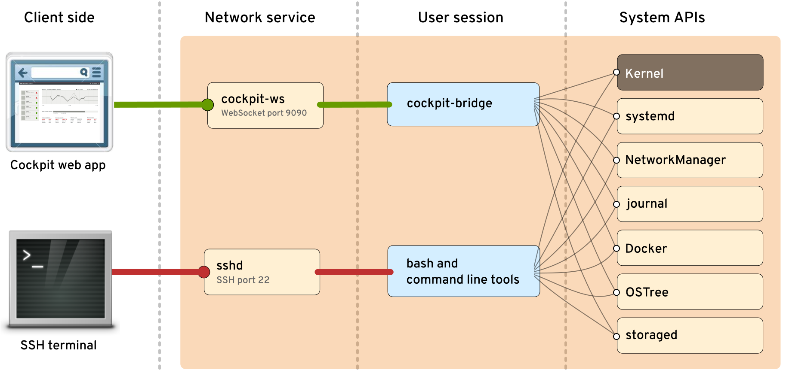

---
title: Monty Python's Flying Cockpit
subtitle: devconf.cz 2023
author:
 - Allison Karlitskaya, Martin Pitt
email: allison.karlitskaya@redhat.com, mpitt@redhat.com
theme: Singapore
header-includes:
 - \hypersetup{colorlinks=true}
 - \setbeameroption{hide notes}
...

# Cockpit intro

- Interactive Server admin web interface
- Setup and troubleshooting for one or a few machines

:::notes
- For this talk we assume a basic familiarity with Cockpit
- If you have never seen it, the short-short version.
- Conceptually: Linux session running in a web browser; moral server equivalent of what GNOME is on a desktop
- Tool for experimenting, learning, troubleshooting, and doing infrequent tasks
:::

# Architecture

 \

:::notes
- To understand this talk, you need to know a bit about how cockpit works internally
- Consider what happens with normal SSH session: You want to do stuff on a
  remote OS which requires running commands, opening files, perhaps talking
  to a TCP port, and so on. But all that SSH gives you is a text stdin and
  stdout, i.e. a pipe pair.
- What you need to connect these is something that translates
  between that pipe and the executables, sockets, D-Bus interfaces of the OS.
  That is a shell like "bash" for an interactive SSH session.
- Cockpit is a web UI written in JavaScript, but it's the same situation: The
  browser possibly runs on the other side of the planet, and it
  can only talk "websocket", which is essentially a pipe. For cockpit,
  the translator is the bridge. It translates these OS interfaces to a
  multiplexed JSON stream.
:::

# Demo: Fedora Server

:::notes
- This is the Cockpit Client flatpak, probably the easiest way to consume cockpit if your desktop runs Linux
- Can connect to any ssh target
- Connect to fedsrv with stable client
- Show `rpm -qa cockpit` in Terminal, installed by default
- Put myself in the position of the cockpit web UI; connect via SSH to fedsrv and run the bridge
- `cockpit-bridge --interact=---`, with bridge-cli.txt
- We can run a program with arguments, for example ping; we get the chunks of output, and eventually an exit code
- bridge has many channel types, for the file system, sockets, D-Bus, inotify, or metrics (second demo)
- roughly machine readable version of bash
:::

# Demo: Connect to a CentOS 9 Stream cloud instance

:::notes
- Connect to "fresh cloud instance" `c9s`, get "no bridge found", sob
:::

# Making the bridge portable

 \

:::notes
- What can we do? have the bridge pre-installed somehow. It's in C to be performant and be able to talk to low-level sys
  ifaces
- Lis: We could rewrite the bridge in Python! -- Whaat? No, that can never
  work. too slow, C bridge is thousands of lines, it'll be too
  hard. And how would we even get that to the remote?
- And besides, what has the Python empire ever done for us? ubiquitous, portable,
  performant with asyncio, bindable with ctypes, much easier/faster to develop
- Lis: It's funny you mention this cockpit-bridge thing, because I've
  been working on this little program called hello world.  It's really similar
  to the bridge in a lot of ways.  I wrote it in py and it works great!
  And you can run it on places where it's not installed!
- Martin: srsly?  How can you run something that's not installed?
- Lis: Have you heard of this www thing?  People are running stuff all the time
  without installing it.
:::

# What's a web app?

- Server delivers the app to the client and the client runs it.
- HTTP + Javascript/CSS/HTML.
- Interaction with the user

:::notes
The web is an ubiquitous protocol (HTTP) paired with an ubiquitous execution
environment (Javascript + HTML).  The server delivers apps to the client.
:::

# Reverse the idea

- Clients can deliver applications to servers
- SSH + Python
- Interaction with the server OS (via Python standard library).

:::notes
- We've built something around the opposite idea.  An ubiquitous protocol (SSH)
  paired with an ubiquitous execution environment (Python).  The client delivers
  apps to the server.

- Same stack as Ansible, which is very widely supported.

- How do we do that?
:::

# beiboot

Turn a Python interpreter into a complex interactive Python program.

The interpreter can be running in a "different environment".

:::notes
beiboot is a commandline tool and a library for getting a Python program from
one execution environment to another.  Our motivating usecase was ssh, but
there's a lot of commands like SSH to get you to a "different environment".

:::

# "Different environments"

A stdin/stdout/stderr connection to a command running somewhere else.

- `ssh machine` ...
- `sudo` ...
- `podman exec container` ...
- `flatpak-spawn --host` ...

:::notes
All of these commands are basically ways to run another command in a different environment.
:::

# "Different environments"

A stdin/stdout/stderr connection to a command running somewhere else.

- `ssh machine python3 -i`
- `sudo python3 -i`
- `podman exec container python3 -i`
- `flatpak-spawn --host python3 -i`

:::notes
And for our purposes, the command in question can be a Python interpreter.

And the nice thing here: you have a Python interpreter running.  stdin, stdout,
stderr are connected.  It actually doesn't matter where this interpreter is
running.  You can start typing commands into the interpreter and stuff starts
happening.

What what about sending a complex Python program?  With multiple files?  Maybe
multiple packages.  Maybe binary data.
:::

# beipack

A tool for turning a complex Python program (with libraries, modules, packages,
data files, etc.) into a single Python script.

Similar in spirit to `zipapp` files, but a bit better for our use case.

:::notes
beipack is a tool for collecting files in various ways (listed on commandline,
PEP 517 builds, installed modules, etc) and bundling them together in a Python
dictionary which is made available via a custom importlib loader.

We originally started with pyz, but it has to be written to the disk first, and
doesn't fit the model of delivering data purely to the interpreter.
:::

# Putting it together: Hello World

:::notes
- `cd app`
- show hello.py
- show info.py
- build the beipack (make)
- show the contents of the beipack (xzcat...)
- boot the beipack on local (beipack --xz ...)
- boot the beipack sudo
- boot the beipack ssh

Internally, beiboot sends a stage1 bootloader over to the other side which
requests the beipack.xz file, decompresses it, and executes it.
:::

# beiboot + beipack: self-containment

```
    # beiboot stage1
    src = lzma.decompress(src_xz)
    exec(src, {
        '__name__': '__main__',
        '__self_source__': src_xz,
        '__file__': filename})
```

```
    # beipack Loader
    def __init__(self, contents: Dict[str, bytes]):
        try:
            contents[__file__] = __self_source__
        except NameError:
            pass
```

:::notes
This is one of the more magic features of this arrangement, and it's one that's
important to our usecase.  A beibooted program is capable of self-replication.

The normal idea when using beipack and beiboot is that the beipack of the
program is created and compressed at build time and stored as package data.

When the program is beibooted on the other machine, we send that beipack to the
beiboot stage1 and it makes it available to the loader, so it can be loaded
again by the program, in the same way and sent on to further environments.

That happens for starting the root bridge on Cockpit.  First step: start the
bridge on the remote machine via ssh.  Second step the remote bridge can start
a second copy of itself via sudo.
:::

# Demo: Portable bridge

:::notes
- Remember that c9s machine? Let's start our beta version of cockpit's flatpak with the Python bridge
- Connect to c9s, watch jaws drop
- More pages available, like podman; show magic bridge in ps ux
:::

# Rollout plan

Python bridge:

 * now: Fedora Rawhide, Debian unstable, Arch
 * soon: Fedora 38, C9S/RHEL 9 devel
 * not: Debian stable, Ubuntu 22.04 LTS, RHEL 8

beiboot functionality:

 * now: Flatpak beta
 * soon: cockpit/ws container
 * all these OSes supported as connection targets

:::notes
- We've been developing pybridge in the main branch of cockpit with a configure option
- Fixed last critical regression last week, but still a few unstable tests
- Launched to Fedora rawhide, Debian unstable, Arch three days ago
- Soon enough Fedora 38 and C9s/RHEL 9 devel
- Don't switch long-term support releases, such as Debian stable, Ubuntu LTS, RHEL 8
- Looking for regression reports
- remote bridge functionality only in the flatpak for now, and cockpit webservice container soon
- distro and container world are separate use cases for now, still needs discussion where we want to go there eventually
:::


# Q & A

Links:

- [Flatpak install instructions](https://cockpit-project.org/blog/cockpit-294.html)
- [beipack project](https://github.com/allisonkarlitskaya/beipack)
- [systemd_ctypes project](https://github.com/allisonkarlitskaya/systemd_ctypes)

Contact:

- `#cockpit` on Fedora Matrix
- https://cockpit-project.org

:::notes
- Home page leads to mailing lists, chat, documentation
- thanks for your attention; Q+A
:::
