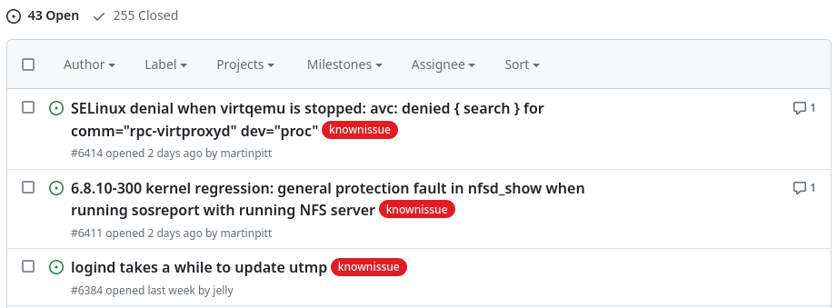
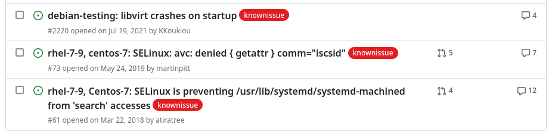
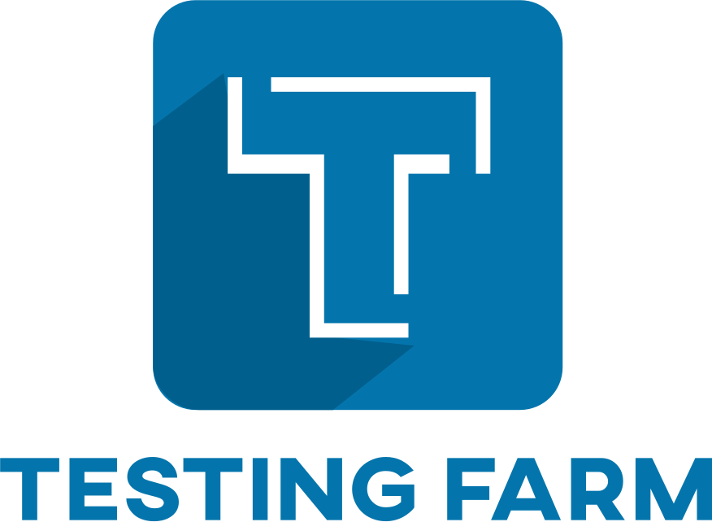
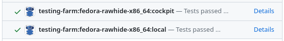
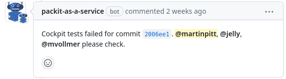

---
title: Upstream cross-project testing
subtitle: Never break your API consumers
author: Martin Pitt <<mpitt@redhat.com>>
email: mpitt@redhat.com
theme: Singapore
colorlinks: yes
header-includes:
 - \setbeameroption{hide notes}
...

# Traditional feedback cycle

**Via release and distro**

::: incremental
1. propose upstream change
2. upstream change lands
3. release
4. distro packaging and publishing
5. consuming project spots and reports regression
6. bug fix, goto 1
:::


# Fallout

[https://github.com/cockpit-project/bots/labels/knownissue](https://github.com/cockpit-project/bots/labels/knownissue)

 \
 \

:::notes
- promote collaboration and co-development between FOSS projects
- traditional feedback cycle for how changes, and in particular, regressions become visible to consumers
- each of these steps takes days (frequent releases with rawhide) days to months (rare releases, LTS)
- demotivating and inefficient: when you get bug report, all knowledge and context are gone
- (fallout) cockpit project: top of the dependency tree, find lots of regressions in all OSes
- elaborate system to track these; oldest from 2018, 10 have been open since 2021 or earlier
- long cycle doesn't work: the damage is done, nuisance
:::

# Proposed feedback cycle

**Shift left!**

::: incremental
1. propose upstream change
2. consuming project tests run against MR/PR
3. iterate proposal until green
4. {height=20%} \
:::

# Approach

\center

{width=25%} \qquad
{width=20%} \qquad
{width=15%}

\vfill

consumer `packit.yaml`:
\scriptsize
```yaml
                         - job: copr_build
                           trigger: commit
                           owner: "@consumer"
                           project: "main-builds"
```

\vfill

{width=80%} \

:::notes
- tighten feedback to "immediate", "shift left" in fancy parlance
- (2.) catch regressions *before* they land and affect users
- consumer's tests run in PR, result in minutes/hours, current state in mind,
- (3.) consumer sees change, no bisecting distro, land w/ confidence
- (4.) build better relationship instead of yelling
- (Approach) build with public infra: copr, TF, packit
- consumer: (some) tests run through tmt (Fedora/RHEL gating)
- consumer: build COPR from main branch (cf. PR packit COPRs)
- your project: tell packit.yaml to run consumer test plan (bit technical, not shown here)
- see the result in PRs (local: your own, cockpit: consumer)
:::

# Experience

- mostly social effort, not technical
- first [podman regression #19888](https://github.com/containers/podman/pull/19888#issuecomment-1711548343)
- Cockpit tests run in podman, udisks2, and selinux-policy

\vfill

{width=80%} \

:::notes
- podman used to be one of our main regression sources, first enabled
- only after a few days: caught our first regression; collaborated in PR
- process works reasonably well, better working relationship
- since then we enabled it in some more projects
- be aware: opt-in, discuss, work together, and establish rules (response time)
- automatic notification of consumer proj devs in PR
- doesn't scale well, but tremendously helps with key dependencies
:::


# Q & A

Contact:

- Email: mpitt@redhat.com
- `pitti` in `#cockpit` on [Fedora Matrix chat](https://chat.fedoraproject.org/#/room/#cockpit:fedoraproject.org)

\center

[https://cockpit-project.org/blog/tmt-cross-project-testing.html](https://cockpit-project.org/blog/tmt-cross-project-testing.html)

{width=45%} \
