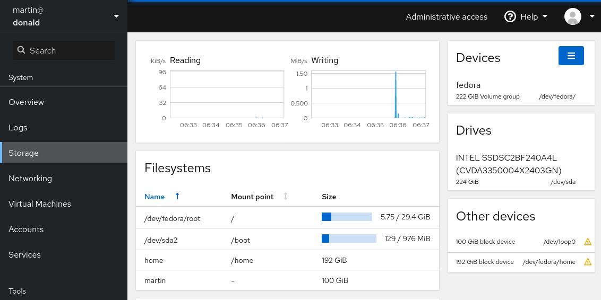

---
title: Cockpit Infrastructure
subtitle:
author:
 - Martin Pitt, Sanne Raymaekers
email: mpitt@redhat.com, sraymaek@redhat.com
theme: Singapore
header-includes:
 - \hypersetup{colorlinks=true}
 - \setbeameroption{show notes}
...

# Cockpit Team



- Interactive Server admin web interface
- Included in all major distros, uses over 100 OS APIs
- 7 team members
- Automated tests, releases, npm/translation updates, VM/container image refreshes

:::notes
- Conceptually: Linux session running in a web browser; moral server equivalent of what GNOME is on a desktop
- talks to > 100 system APIs, times > 10 supported OSes → moving target, combinatorial explosion, things break all the time
- small team, heavily dependent on infrastructure
- automated testing, releasing, code hygiene, updating VM and container images
:::

# Our Automation Principles

\qquad \qquad \qquad \qquad {width=12%} \qquad \qquad {width=12%}

Containerize everything → simple and safe to run locally

No magic infrastructure → reproducible, cloud portability

Automated deployment → scalable, recoverable, ~~bus factor 1~~

:::notes
- Humans first: Make it simple and enjoyable to locally hack on tests, automation, CI
- happens that these very qualities make it easy to deploy to infra
- Containers are easy to reproduce, easy to run locally and on different cloud platforms/CI providers
- infra uses the exact same containers and commands as humans, just more powerful
- Deployed using publicly available ansible scripts
:::

# Which infrastructure exactly?

- GitHub workflows for all non-KVM tasks
- CentOS CI: Kubernetes ReplicationController
- bos.e2e: systemd-controlled docker
- AWS: on-demand c5.metal instance, \$\$\$, systemd podman

:::notes
- GitHub's infra is unlimited, free, zero admin cost
- …. use for releases, container refreshes, and more
- tests need /dev/kvm access and internal network access depending on the tested OS
- CentOS CI ocp: powerful, free, many nodes; no internal tests; RCs
- e2e: 10 real-iron powerful machines; internal tests; systemd autorestart controlled docker instances
- AWS: on-demand test fallback in case e2e goes down, but pricey (\$100/day)
- … permanent image server backup and log store; cheap virtualized instances
:::

# Event flow for releases

```sh
$ git tag -s -m '123

- cool new feature A
- fix heisenberg compensator on Fedora (rhbz#1234)
'
```

→ [.github/workflows/release.yml](https://github.com/cockpit-project/cockpit/blob/master/.github/workflows/release.yml) runs release container

→ GitHub release, Fedora dist-git+koji+bodhi, COPR, DockerHub, docs on cockpit home page

:::notes
- Explain a bit *what* we run on the infra; first example is releases
- minimized human work: summarize news, push signed tag, everything else is fully automated
- pushing tag triggers release workflow
- runs release container; looks at "cockpituous" script of the particular project, which controls what/where exactly to release
:::

# Event flow for tests

{height=95%}

:::notes
- tests infra is more complicated, no GH workflows yet
- starting point: GitHub event: something happens, like open PR; calls URL in your infra with JSON payload
- ephemeral → translate to distributed, transactional work queue: AMQP; very simple to use, robust, small; eats Jenkins for breakfast
- webhook pod is simple Python script + off-the-shelf rabbit container
- just single instance on CentOS CI; auto-recovers through PR/issue scanning (github is single source of truth)
- thus we can deal with few hours downtime, but not with days
- dozens of worker bots on various clouds connect to AMQP and run tasks
:::

# Strong aspects of our CI

- reproducible, portable
- platform agnostic work queue
- deployment only through Ansible
- fully automated releases
- separate changes in our code from changes in OSes

:::notes
- make use of hybrid cloud; harness lots of powerful resources whereever we can get them
- for example, we can run our tests on Travis unmodified; just run it in our tasks container
- robust and simple work queue
- push-button releases
- Intro mentioned combinatorial explosion of OSes times APIs; we are everybody's OS regression test
- became good at isolating our changes from ever-changing/regressing OSes around us
- semi-auto-refreshed OS images, tests run completely offline
- find and investigate OS regressions at VM image update time, not in project PRs
- fully automatic tracking of OS regressions
:::

# Weak aspects/challenges of our CI

- arcane test logging and artifacts
- precarious e2e machines
- no monitoring/alerts
- hard to find public infra with /dev/kvm

:::notes
- our test logging/artifact infra is very arcane, too much custom logic; needs SSH, SPOF; want to move to standard infra (http post, s3, loki, etc.)
- e2e machines are ever more difficult to keep running; old RHEL 7 and no automation around Satellite; need well-maintained internal infra
- use host journal and k8s container logs for investigating failures; no automated monitoring (except for email on bot crash), notification, or prevention
- has not been a big enough pain point: no precious state in our CI, can re-scan github
- hard to find public infra with /dev/kvm: Travis for a while, but they stopped having free plans
:::

# Links/Documentation
- [source.redhat.com/groups/public/cockpit/ cockpit_wiki/cockpit_ci_resources](https://source.redhat.com/groups/public/cockpit/cockpit_wiki/cockpit_ci_resources)
- [github.com/cockpit-project/cockpituous/](https://github.com/cockpit-project/cockpituous/)
- secrets in internal CEE GitLab repo, only accessible to a few team members
- [github.com/cockpit-project/bots](https://github.com/cockpit-project/bots)
- `#cockpit` on Freenode, [cockpit-devel@lists.fedorahosted.org](https://lists.fedorahosted.org/archives/list/cockpit-devel@lists.fedorahosted.org/)

:::notes
- finally, where can you look at our stuff and steal or contribute
- top-level document on the source, describes available internal and external infra, lots of pointers
- public cockpituous repo has all our infra containers and Ansible scripts
- secrets like Fedora password, GitHub or COPR token are in a very restricted internal CEE GitLab repo
- bots is the code that runs inside containers; grab AMQP work queue item, invoke test, update
  translations, build VM image
- you can always say hi on IRC or ask on our mailing list
:::
