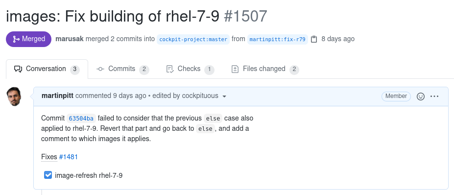
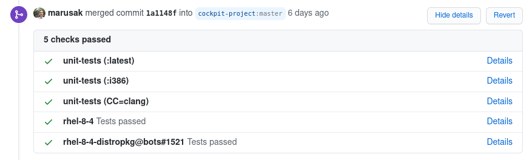
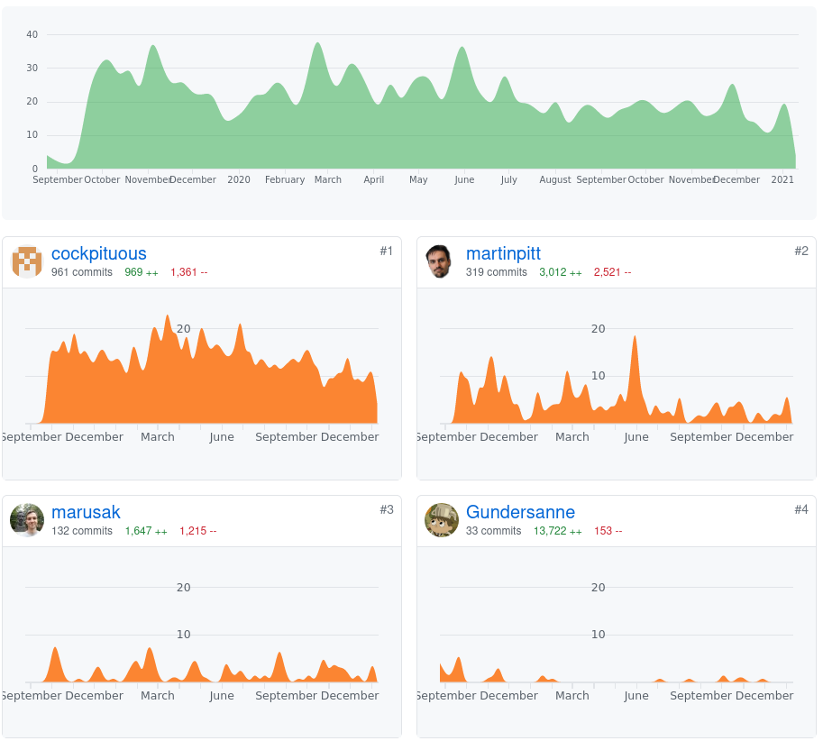
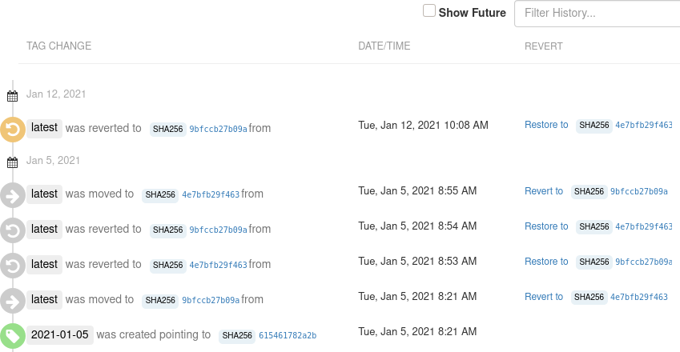

---
title: How we hack on Cockpit Infrastructure
subtitle:
author:
 - Martin Pitt, Sanne Raymaekers
email: mpitt@redhat.com, sraymaek@redhat.com
theme: Singapore
header-includes:
 - \hypersetup{colorlinks=true}
 - \setbeameroption{hide notes}
...

# Goal

treat infrastructure as code

self-validating PR → container rebuilds, private temp deployment, tests against product main branches

land PR → redeploy to production

:::notes
- most of us have become really good at self-validating changes to our product
  code (so not infra code) with test gating
- ideal: want to treat changes to infrastructure alike: submit a PR, builds and
  tests changed container images => you want fully automated luxury ci/cd for your ci/cd
- in Cockpit team we mostly are there for the workloads that run inside the
  infra, but still quite far from that for changing the infra itself (meaning
  containers and deployment via ansible to openshift etc...)
- for cockpit infra it takes a lot of learning of new concepts and infrastructure, needs to offset the cost of classic deploy-watch-rollback
:::

# Updating unit test container

[.github/workflows/unit-tests.yml](https://github.com/cockpit-project/cockpit/blob/master/.github/workflows/unit-tests.yml):

\footnotesize
```yaml
name: unit-tests
on: pull_request
[...]
  - name: Build unit test container if it changed
    run: |
      changes=$(git diff origin/master..HEAD --
                containers/unit-tests/)
      [ -z "$changes" ] || podman build \
        --tag ghcr.io/cockpit-project/unit-tests \
        containers/unit-tests/

  - name: Run unit-tests container
    run: |
      podman run -v $(pwd):/source:ro \
         ghcr.io/cockpit-project/unit-tests
```

:::notes
- a simple case where this works well is our unit-tests container for cockpit
- you see simplified workflow that runs on PRs
- normal PRs pull container from the registry
- PR that touches anything in the container definition rebuilds the container, and runs unit tests against that local build
- provides self-validation that we want
- fairly new, currently missing: automatically refresh the container on registry on landing
:::

# Keeping unit-tests container up to date

[workflows/unit-tests-refresh.yml](https://github.com/cockpit-project/cockpit/blob/master/.github/workflows/unit-tests-refresh.yml)

\footnotesize
```yaml
on:
  schedule:
    # auto-refresh every Sunday evening
    - cron: '0 22 * * 0'
[...]
  - name: Build fresh containers
    run: |
      podman build --tag ghcr.io/cockpit-project/unit-tests \
         containers/unit-tests/

  - name: Run amd64 clang test
    run: containers/unit-tests/start CC=clang

  - name: Push containers to registry
    run: podman push ghcr.io/cockpit-project/unit-tests
```

:::notes
- because unit-tests container is easy to self-validate, we can keep it up to date automatically
- every week a scheduled workflow rebuilds the container, runs all unit test scenarios
- if they succeed, push it to the registry
- if they fail, GitHub sends a failed workflow notification email; investigate
- in the latter case, PRs just keep using the previous container; no urgency
:::

# Developing GitHub workflows

Test on your fork:

- example: [cockpit-ostree npm-update](https://github.com/cockpit-project/cockpit-ostree/pull/154)

- example: [homepage docs auto-update](https://github.com/cockpit-project/cockpit-project.github.io/pull/364)

[Interactive SSH for debugging](https://github.com/mxschmitt/action-tmate):

    uses: mxschmitt/action-tmate@v3

:::notes
- Almost trivial, just for completeness
- No persistent deployment for GitHub; this "serverless" architecture avoids the whole initial problem
- Anyone can test changes on their own project fork
- the two real-life examples are clickable links, if you want to peek into how that looks like
- Biggest stumbling block there are secrets -- you may need corresponding "forks" on quay.io, or upload the official secrets to your own forked project
- standard action on the market place for getting interactive ssh into the GitHub VMs
:::

# Self-validating bots



:::notes
- As mentioned yesterday, bots has all the code that runs *inside* of our tasks
  containers; invoke tests, update translations, build VM image, etc.
- by far the most busy CI related project, several changes every day
- here I made a change to the build script of the rhel-7-9 image
- I added this little checkbox with a task to rebuild the image, the bot did it, committed the result to the PR, and checked the box
- The refresh used the code from the PR
:::

# Run PR against a bots PR



:::notes
- We can also run a cockpit or other project test against non-master bots with a special test syntax
- Useful for new test features/fixes required by other projects
- Trigger the test, and only land the bots PR on success
:::

# Self-maintaining bots



:::notes
- fun fact: the biggest contributor to bots by a wide margin is.. the bots
- bulk is automatic image refreshes (and other trivial but important work), triggering all affected tests
- we could fully automate their landing, but we like to press green buttons!
- more often than you'd think these have test failures due to OS changes/regressions so constant image refreshes are very useful
:::

# Updates to deployed infrastructure

\qquad \qquad \qquad \qquad {width=12%} \qquad \qquad {width=12%}

Simple revert on [quay.io tag history](https://quay.io/repository/cockpit/tasks?tab=history):

{width=80%}

:::notes
- changes to the deployed infra itself are farthest away from that goal, fortunately also rare
- updating tasks container: send PR, build/push/deploy it, trigger/wait for some representative test runs, watch out for regressions
- we can run the new container locally or on the infra and do a smoke test
- usually we can run the new container within the current production environment without taking it down, still not a great workflow however
- quay.io offers a nice and simple way to revert a tag on the web UI (easier than on the CLI)
- similar situation with changes to kubernetes resources, Ansible scripts, etc.
- we don't have sharding of our infra and per-developer tenants
- so we usually deploy right to production and roll back on failure
:::

# Links/Documentation
- [source.redhat.com/groups/public/cockpit/ cockpit_wiki/cockpit_ci_resources](https://source.redhat.com/groups/public/cockpit/cockpit_wiki/cockpit_ci_resources)
- [github.com/cockpit-project/cockpituous/](https://github.com/cockpit-project/cockpituous/)
- secrets in internal CEE GitLab repo, only accessible to a few team members
- [github.com/cockpit-project/bots](https://github.com/cockpit-project/bots)
- `#cockpit` on Freenode, [cockpit-devel@lists.fedorahosted.org](https://lists.fedorahosted.org/archives/list/cockpit-devel@lists.fedorahosted.org/)

:::notes
:::
